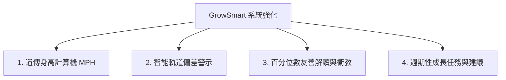

# GrowSmart 系統強化規劃書：解決父母對兒童成長的焦慮

經過市場調查與家長心聲分析，父母對於「兒童成長曲線」最感到焦慮、擔心的痛點，主要集中在以下幾個維度。本計畫書將針對這些痛點，提出具體的系統功能強化方案。

---

## 🔍 父母最擔心的成長痛點分析

### 1. 百分位數低落的「數字焦慮」
* **家長焦慮：** 看到孩子落在第 10 百分位（P10）甚至更低，便誤以為孩子「不正常」或「營養不良」，容易與班上其他高大同學做「目視比較」，引發無謂的集體焦慮。
* **醫學事實：** 只要落在第 3 到第 97 百分位之間，且**持續沿著自己的生長曲線前進**，皆屬於正常健康的範圍。

### 2. 生長軌道偏離（突然暴衝或暴跌）
* **家長焦慮：** 孩子身高在幾個月內完全停滯，或者百分位突然從 P50 跌落至 P15。
* **醫學事實：** 單次數值並不重要，醫師更看重「長期走勢」。若曲線短時間內「跨越兩條以上的百分位線」或「學齡期一年身高長小於 4 公分」，才是需要就醫的真正警訊。

### 3. 遺傳身高落差（到底能長多高？）
* **家長焦慮：** 父母自己不高，擔心孩子長不高；或者父母很高，擔心孩子矮人一等。
* **醫學事實：** 身高有 70~80% 來自遺傳，預測成人身高的基準線（標的身高，Target Height）能為家長建立合理的心理預期。

### 4. 性早熟帶來的骨齡提前閉合
* **家長焦慮：** 女兒 8 歲前就發育，或者兒子 9 歲前變聲，擔心成長期提早結束。

---

## 💡 GrowSmart 系統強化功能方案

為了協助父母客觀看待成長數據、減輕焦慮，並在有真正異常時提供警示，建議將系統升級為以下四大核心功能：

### 1. 遺傳身高預測功能 (Mid-Parental Height, MPH)
* **目的：** 結合遺傳因素，幫助家長算出合理的「遺傳靶身高」區間，建立客觀期望值。
* **實作方案：**
  * 在「新增/編輯孩子」表單中，加入**「父親身高」**與**「母親身高」**輸入欄位。
  * 依公式計算 MPH：
    * **男孩** = `(父親身高 + 母親身高 + 13) / 2` (誤差範圍 ± 7.5 cm)
    * **女孩** = `(父親身高 + 母親身高 - 13) / 2` (誤差範圍 ± 6.0 cm)
  * **圖表整合：** 在 Growth Chart 曲線圖上，於成人（18歲/216個月）位置，繪製一條**「遺傳身高目標區間帶（陰影帶）」**。家長可直觀看到孩子目前的成長曲線延伸出去，是否有落在遺傳目標內。

---

### 2. 智能軌道偏差警訊 (Growth Deviation Alert)
* **目的：** 避免家長對單次變動過度緊張，但在出現真正醫學警訊時給予溫馨提醒。
* **實作方案：**
  * 系統在每次新增測量時，比對上一次數據，若發現以下情形，在儀表板頂部彈出「溫馨衛教小卡」（非恐嚇性質）：
    1. **跨軌警告：** 成長曲線跨越兩條百分位線（例如從 P50 掉到 P10，或從 P15 暴增到 P85，後者可能有性早熟風險）。
    2. **生長停滯警告：** 4 歲以上兒童，計算其年化生長速率，若**一年長高小於 4 cm**，則進行提醒。
  * **小卡內容：** 「孩子目前的成長軌跡出現波動。請別緊張，成長速度會受短期因素（如感冒、季節）影響。建議持續觀察 3 個月，若趨勢持續下滑，可尋求『小兒內分泌科』或『兒童生長發育門診』諮詢。」

---

### 3. 百分位數友善解讀 (Friendly Percentile Indicator)
* **目的：** 消除 P3 ~ P15 家長的焦慮感。
* **實作方案：**
  * 修改目前的百分位 Badge（P3/P50/P97），加入動態提示。
  * 點擊百分位 Badge 時顯示彈窗解釋：「P15 代表在 100 位同齡同性別的孩子中，您的孩子排在第 15 名。這屬於完全正常的健康範圍！比起數字高低，孩子穩定地沿著自己的曲線成長才是最健康的表現。」

---

### 4. 成長三元素生活指南卡 (Lifestyle Advisor Cards)
* **目的：** 將數據轉化為實質行動，告訴家長日常生活中該怎麼做。
* **實作方案：**
  * 結合 AI 顧問，根據孩子的年齡與百分位表現，在儀表板生成「日常成長建議卡」：
    * **睡眠 (Sleep)：** 提醒黃金生長激素分泌期（晚上10點至凌晨2點）應進入深層睡眠，提供建議上床時間。
    * **運動 (Exercise)：** 依年齡段推薦高衝擊、跳躍性運動（如跳繩、籃球、彈跳床）。
    * **營養 (Nutrition)：** 提醒避免攝取高糖飲料（高糖會抑制生長激素分泌 2 小時），並建議鈣質與蛋白質每日攝取量。

---

## 🎯 針對「生長曲線落後孩子」的追趕與關懷機制

許多家長在發現孩子生長百分位（如身高或體重）低於第 10 百分位（P10），甚至小於第 3 百分位（P3）時，最大的渴望就是如何實施**「追趕生長」（Catch-up Growth）**。為了真正解答「如何追上曲線」，系統可以擴充以下針對性功能：

### 1. 「追趕速度目標值」比對器 (Catch-up Velocity Target)
* **痛點：** 家長不知道每個月孩子需要長高多少公分，才叫做「有在追趕」。
* **解決方案：** 
  * 計算孩子過去 3 個月或 6 個月的「實際月增長率」（cm/月）。
  * 與 WHO 同年齡同性別的「中位數增長率」進行比對。
  * **正向反饋 (Positive Feedback)：** 如果孩子的實際增長率大於中位數（例如：同齡中位數是 0.5 cm/月，孩子長了 0.7 cm/月），即使目前總身高仍在 P3，系統會提示：「**積極追趕中！** 孩子上個月的成長速度超越了 70% 的同齡孩子，正穩步向上一級百分位前進！請繼續保持目前的營養與作息。」這能帶給家長極大的信心。

### 2. AI 客製化「追趕營養配方」與「脾胃調理計畫」 (AI Catch-up Meal & Activity Planner)
* **痛點：** 許多家長盲目進補，狂喝轉骨湯或強迫灌食高熱量食物，反而造成消化不良或性早熟。
* **解決方案：**
  * 當系統判定孩子處於 P15 以下，AI 成長顧問會自動解鎖並推播「追趕生長食譜建議」：
    * **熱量與優質蛋白：** 提供科學的高熱量密度（如適當添加堅果油、酪梨）與足量優質蛋白（蛋、奶、瘦肉）搭配建議。
    * **微量元素補給指引：** 提示有助於生長發育的微量元素（鋅有助於食慾與細胞生長、鈣與維生素 D3 有助於骨骼延伸）。
    * **避雷指南：** 明確列出應避免的食物（如含糖飲料、油炸物、可能含有環境荷爾蒙的蜂王乳等）。

### 3. 兒科醫學介入就醫評估清單 (Medical Catch-up Checklist)
* **痛點：** 什麼時候該看醫生？去看醫生要檢查什麼？家長心中一片茫然。
* **解決方案：**
  * 提供一份「就醫準備檢查清單」，在孩子生長曲線持續低於 P3 時顯示：
    * **評估時機：** 2 歲以下體重極低、4 歲以上身高每年長不到 4 公分、或生長百分位持續下滑。
    * **建議科別：** 指引家長掛號「小兒遺傳內分泌科」或「兒童生長發育專科門診」。
    * **門診檢查指南：** 告訴家長醫生可能會進行的檢查（如拍左手 X 光評估骨齡、抽血檢測生長激素與甲狀腺素等），讓家長提前做好心理準備，不驚慌。

### 4. 追趕里程碑解鎖 (Catch-up Milestones)
* **痛點：** 成長是一個緩慢的過程，家長容易失去耐心。
* **解決方案：**
  * 當孩子成功從 P3 上升到 P5，或累計追趕高度達到 5 公分時，解鎖「追趕成功勳章」，並提供精美小卡分享，讓家長有成就感，陪伴孩子更有動力。
